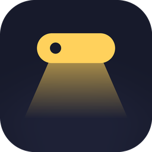
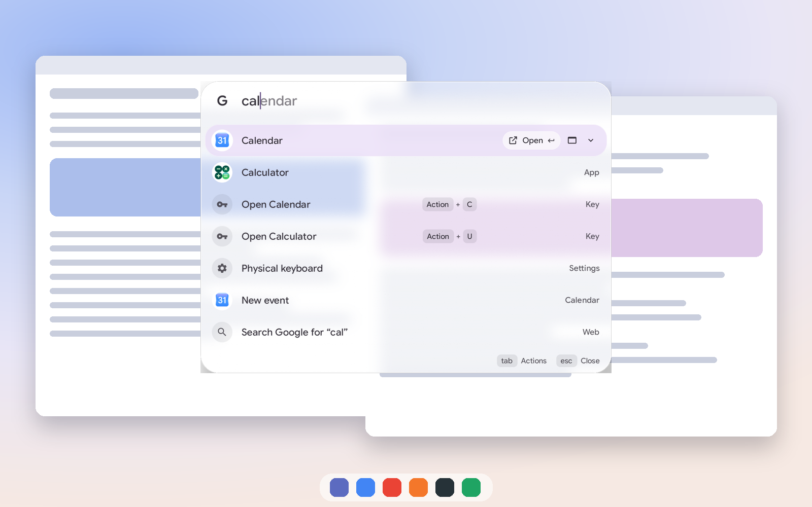

# Booklight

A keyboard launcher for Googlebooks. Press a key, a small glass panel appears over your desktop, type a
few letters, press Enter.



- **Apps first.** The start of a name, the start of any word in it, initials, or a few loose letters.
- **It learns your shorthand.** What you pick for the text you typed comes first next time.
- **Do things inside your apps.** An app's row is Open, Search, Play, Window and an arrow, and an app shows
  what it has: type the app, Tab to what you want, Enter, then the words. `spo`, Tab, Enter, `daft punk` searches
  Spotify; with a free Spotify key of your own, Play finds the song and plays it. "chrome top left" or
  "chrome uninstall" arms that one straight away.
- **Answers on this device.** `fix teh text`, `shorter …`, `de …`, `sum`, `explain …`, or a prompt of your
  own: the system's own model (Gemini Nano, where the device has it) writes the answer into the row.
- **What you just copied.** Open Booklight within two minutes of a copy and one line offers it. Tab opens
  it: the link, the date as an event, a translation, your prompts, or whatever you tell the model to do with it.
- **Flights.** `LH455` names the airline and opens the flight's page. With a free AirLabs key of your own
  the row shows a line with the plane on it, the times, the gate, and whether it is on time; a pinned flight
  shows the same.
- **Keywords that open an app filled in.** `go hamburg hbf`, `meet`, `alarms`, `spotify notifications`, and
  `call`, `sms`, `wa`, `tg` where an app answers them. Booklight dials and sends nothing.
- **Pin.** A note, a sum's answer, a colour, a QR code or a countdown in a small window that stays on top
  and never takes the keyboard.
- **`?` lists everything**, each with an example that Booklight types for you.
- **Jot things down.** `mail …`, `note …`, `event …`, `remind …`, `timer 10m tea`, `new file ideas.md`:
  one line, a preview of what was understood, Enter. Longer questions go to Gemini.
- **Small controls.** `vol`, `brightness`, `pause`; an emoji grid, the letters of other languages (`abc danish`), colour values, QR codes, passwords.
- **Settings pages, sums and the web.** "dark", `150 + 20%`, a typed address, or a search. A keyword
  and a space search one site: `yt lofi`.
- **Your own commands.** Links with placeholders (an app's own address too: `spotify:search:{argument}`),
  snippets, prompts, commands for other apps, and recipes that do several things at once. What your other apps
  offer shows as rows too: `new event`.
- **Glass and motion.** The panel unfolds, lets your desktop show through, and nothing in it pops:
  the highlight moves like rubber, lists cascade in.
- **Private by default.** No account, no ads. Search suggestions are off until you turn them on. What
  you ask the on-device model stays on the device; the Google library that reaches it reports how it is
  used (not your text). [Privacy](PRIVACY.md).

## Install

**[Download Booklight.apk](https://github.com/kuscher/booklight/releases/latest/download/Booklight.apk)**,
open it from Files and, if Android asks, allow Files to install apps. Made for Googlebooks (Android 14 or
newer); on Google Play it is offered to Googlebooks only.

## Give it a key

Booklight opens whenever you start it, so a keyboard shortcut for the app is all it needs:

1. Open **Keyboard shortcuts** (Action + /).
2. Choose **App shortcuts**, then **Add shortcut**.
3. Find **Booklight**, choose **+**, press your keys, then **Set shortcut**.

The system wants the Action key in every shortcut. **Action + Alt + Space** and **Action + K** are both
free. The same keys close the panel again. Booklight shows these steps the first time you open it.

## Keys

| Key | Does |
| --- | --- |
| ↑ ↓ | Move through the rows |
| Enter | Run the armed action of the selected row |
| Tab, Shift + Tab | The row's next or previous action; on a keyword (`s`, `yt`) or its row: make it the chip |
| → at the end of the text, ← | The same; on a level: up and down; in a grid: the next cell |
| Space after a keyword | The keyword becomes a chip; Backspace on an empty field undoes it |
| `?` first | The list of everything Booklight does |
| Shift + Enter | Run and keep the panel open |
| Ctrl + 1…9 | Run that row |
| ↑ on an empty field | The last text you didn't run |
| Esc, a click outside, your shortcut | Close |

## What you can type

| Type | Get |
| --- | --- |
| `chr`, `chrome right third`, `chrome uninstall` | An app, where to open it, and what to do with it |
| `spo`, Tab, Enter, `daft punk` · `netflix`, Tab, Enter, `severance` | A search inside that app |
| `spo`, Tab, Tab, Enter, a song · `play bohemian rhapsody` | Spotify plays it (with your own key) |
| `go hamburg hbf` · `meet` · `alarms` · `spotify notifications` | Directions, a meeting, the Clock's list, an app's page in Settings |
| `fix teh text` · `sum` · `de good morning` · `explain idempotent` | An answer from the model on this device |
| Tab on "Copied 20 s ago · a link and a date" · `tr danish see you on Saturday` | What you copied, opened; a translation |
| `LH455` · `LH455 fri` · `flight u2 8001` | A flight: its page, and with your own key its times |
| `pin gate B22, 14:05` · `timer 10m tea`, Start and pin | A small window that stays on top |
| `s wifi` · `k snap` · `new event` | A settings page, a keyboard shortcut, something another app offers |
| `notes milk` · `todo call the bank` | A line of your notes; your tasks |
| `mail anna@x.com Lunch? / See you at 1` | A filled-in compose window |
| `note buy milk` · `event Fri 3pm Dentist` · `remind 5pm call bank` | A note, an event, a reminder |
| `timer 10m tea` · `alarm 7:30` · `new file ideas.md` | A timer, an alarm, a new file |
| `vol 40` · `brightness` · `pause` · `play lofi` | Controls |
| `emoji party` · `sym arrow` · `abc german` · `#3478f6` · `qr …` · `password 20` | Things to copy |
| `yt lofi` · `gh owner/repo` · `:3000` · `ask …` | The web, GitHub, localhost, Gemini |
| `snip sig` · `clip` · your own keywords | Your snippets, your clipboard, your links and recipes |

## The Booklight window

The app's icon opens an ordinary desktop window with everything else, its navigation on the window's edge, in
six sections: Start (what Booklight is, your key, tips, your usual, what you copied), Commands (everything it
does, and yours: links, snippets, recipes, prompts; Enter on a row types the example into the panel), Look
(theme, colours, glass, shadow, opening, with a live preview), Results (the search engine, suggestions, which
kinds of rows show, other apps' commands), Labs (what needs a key of your own: Spotify, flight times) and Privacy (the notes folder, brightness,
what Booklight keeps, about). "Booklight settings" in the panel opens it too.
A search-pill widget and a Quick Settings tile open the panel without a keyboard.

## Building

Android Studio's JDK 21 and the Android SDK (platform 37.0).

```bash
./bl test        # the search core's tests, on this machine
./bl app         # build, install and open on the attached Googlebook
```

`core/` is plain Kotlin (matching, ranking, learning, the calculator, the parsers for dates, mail and the rest); `app/` is the Compose app. See
[CLAUDE.md](CLAUDE.md) for the map, [docs/PLAN.md](docs/PLAN.md) for where it is going and
[docs/RELEASING.md](docs/RELEASING.md) for releases.

## License

MIT. A personal hobby project, published as Fika Labs; not affiliated with or endorsed by any employer or
by Google.

— Fika Labs
